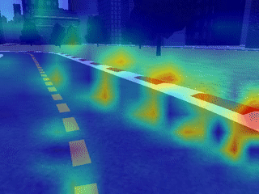

# AWS DeepRacer Video Visualizations
Repository containing tools to visualize AWS DeepRacer (training) runs. Currently only a visualization based on GradCam is supported.

# Setup
## Requirements
- Python 3
- [Poetry](https://github.com/sdispater/poetry)

## Installation
First prepare the Python enviroment using `poetry install`.
Available tools can be found in the `tools` folder. Before running a tool make sure the virtual environment is activated using `poetry shell`. You may need to use a venv or conda env to get the right python version (3.7) for poetry.

## Downloading your model
You can obtain your model graph in the form of a `.pb` file either from S3 or from the DeepRacer console.
- S3 -> Go to the S3 folder in which the training run is stored. Here you can download the model files per checkpoint.
- Console -> Select your training run and choose `Download model`. Inside the obtained `.tar.gz` you can find your `model.pb` file. 

# Visualization tools
Example: run `python tools/gradcam.py  ~/Desktop/model.pb 1  -i 192.168.1.*** -p ********` for live gradCAM of DeepRacer feed. Make sure you are on the same wifi network as your DeepRacer and that you have the correct IP and password. Press `esc` to stop running the program.

## Kinesis Downloader
Can be used to view and store the live feed of a training job. This is the same feed that is shown in the AWS DeepRacer console.

`python download_kinesis.py <Kinesis Video Stream Name> -o <output_file.mp4>`

## GradCam
Overlays a Gradient-weighted Class Activation Mapping ([Grad-CAM, Selvaraju et al.](https://arxiv.org/abs/1610.02391)) over an input video for a given action.
It takes as input the action number of the action in `model_metadata.json` or the DeepRacer console for which it then computes the activation map using the model stored in `model.pb`.

`python gradcam.py <input_file.mp4> -m <model.pb file path> -a <action index> -o <output_file.mp4>`
